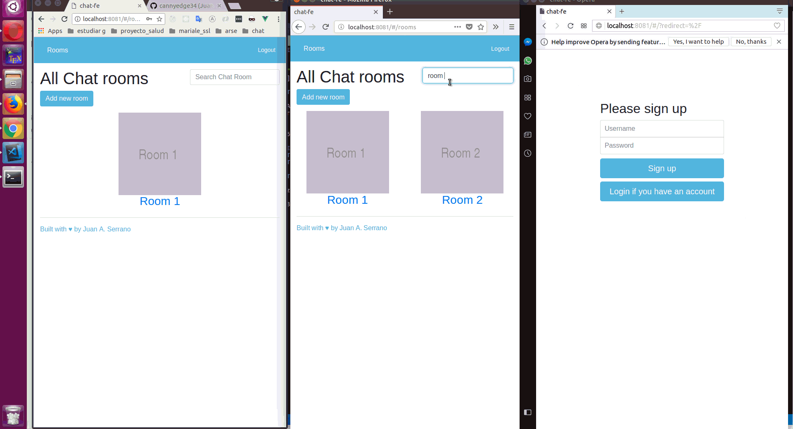

### Getting Started

This is a vuejs front-end example chat. You can have a look at the video below. You can find the back-end example chat made with vuejs at https://github.com/cannyedge34/chat-back-end.git

Full Demo Video example: https://youtu.be/JIFLc5XtfeU



This project was bootstrapped with Vuejs and Twitter Bootstrap. It is not tested in production environment, it is just an example app. So, use it under your responsibility.


## Build Setup

``` bash
# install dependencies
npm install

# serve with hot reload at localhost:8080
npm run dev

# build for production with minification
npm run build

# build for production and view the bundle analyzer report
npm run build --report

# run unit tests
npm run unit

# run all tests
npm test
```

For a detailed explanation on how things work, check out the [guide](http://vuejs-templates.github.io/webpack/) and [docs for vue-loader](http://vuejs.github.io/vue-loader).
